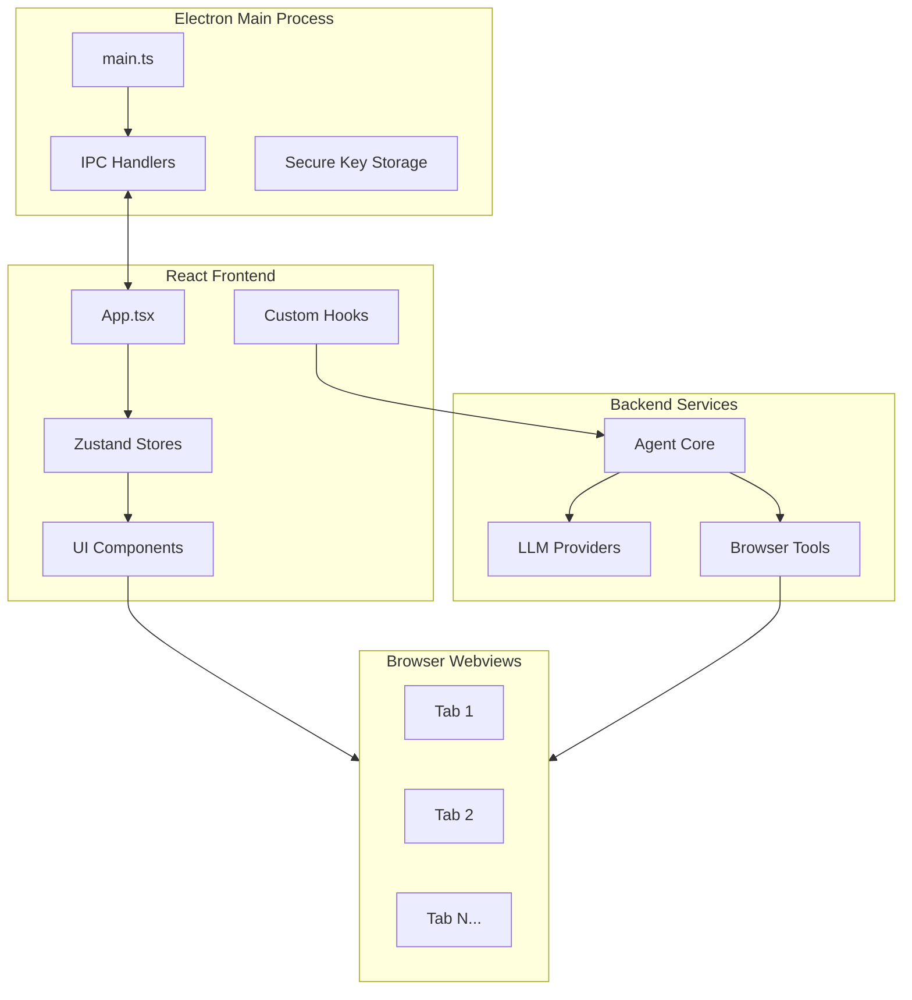
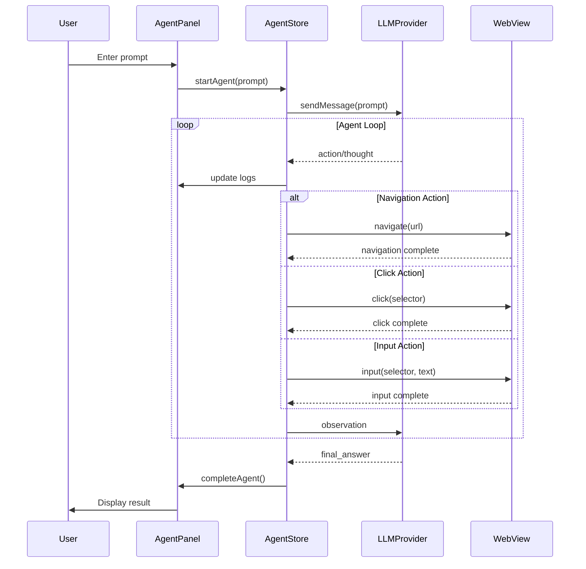
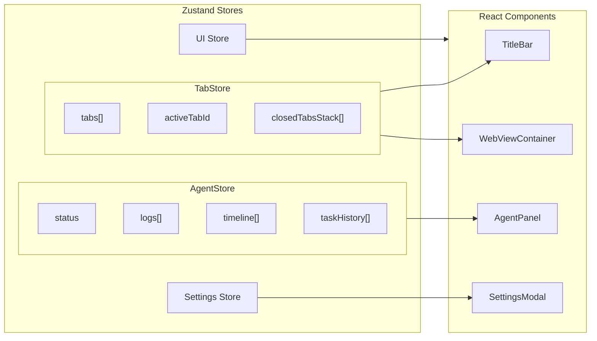

# Netsurf

> A production-grade, Chrome-like browser with integrated AI agent capabilities. Built with Electron + React + TypeScript.

[](https://www.typescriptlang.org/)
[](https://reactjs.org/)
[](https://www.electronjs.org/)
[](LICENSE)

---

## ✨ Features

| Feature | Description |
|---------|-------------|
| 🌐 **Modern Browser** | Full Chrome-like tabbed browsing experience |
| 🤖 **AI Agent** | Integrated AI that can browse, search, and complete tasks autonomously |
| 🎨 **Beautiful UI** | Dark/light themes with smooth Framer Motion animations |
| ⚡ **Fast** | Vite-powered development, optimized production builds |
| 🔒 **Secure** | Sandboxed webviews, encrypted API key storage |
| ⌨️ **Keyboard First** | Full keyboard navigation with customizable shortcuts |

---

## 🏗️ Architecture

### High-Level System Architecture



### Agent Execution Flow



### Frontend State Management



---

## 🚀 Quick Start

### Prerequisites

- Node.js 18+
- npm 9+

### Installation

```bash
# Clone the repository
git clone https://github.com/Kritavya/agentic-browser-electron.git
cd agentic-browser-electron

# Install dependencies
npm install

# Start development server
npm run dev
```

### Build for Production

```bash
# Build the application
npm run build

# Package for distribution
npm run package
```

---

## ⌨️ Keyboard Shortcuts

| Action | Shortcut |
|--------|----------|
| New Tab | `Ctrl+T` |
| Close Tab | `Ctrl+W` |
| Next Tab | `Ctrl+Tab` |
| Previous Tab | `Ctrl+Shift+Tab` |
| Reopen Closed Tab | `Ctrl+Shift+T` |
| New Window | `Ctrl+N` |
| Focus Address Bar | `Ctrl+L` |
| Open History | `Ctrl+H` |
| Open Downloads | `Ctrl+J` |
| Toggle Agent Panel | `Ctrl+Shift+A` |
| Open Settings | `Ctrl+,` |
| Reload Page | `Ctrl+R` / `F5` |
| Toggle Vertical Tabs | `Ctrl+Shift+V` |

---

## 📁 Project Structure

```
agentic-browser-electron/
├── electron/           # Electron main process
│   ├── main.ts         # Main entry, window management
│   └── preload.ts      # Context bridge, IPC
├── frontend/           # React frontend
│   ├── app/            # Root components
│   ├── components/     # Shared UI components
│   ├── features/       # Feature modules
│   │   ├── agent/      # AI agent panel
│   │   ├── tabs/       # Tab bar system
│   │   └── history/    # History panel
│   ├── hooks/          # Custom React hooks
│   ├── store/          # Zustand state stores
│   └── theme/          # Design system
├── backend/            # Backend services
│   ├── models/         # LLM provider configs
│   └── tools/          # Agent tool definitions
└── package.json
```

---

## 🔧 Tech Stack

| Layer | Technology |
|-------|------------|
| **Desktop** | Electron 29 |
| **Framework** | React 18 + TypeScript 5 |
| **Styling** | Tailwind CSS + CSS Variables |
| **Animations** | Framer Motion |
| **State** | Zustand |
| **Icons** | Lucide React |
| **Bundler** | Vite |

---

## 🤖 AI Providers

Supports multiple LLM providers:

| Provider | Models | Free Tier |
|----------|--------|-----------|
| **OpenRouter** | Kimi K2, Gemma 3, Qwen3, Llama 3.3 | ✅ Yes |
| **Google** | Gemini 2.5 Flash, Gemini 3 Flash/Pro | ✅ 20 req/day |
| **Anthropic** | Claude 3.5 Sonnet, Claude 4 | ❌ No |
| **OpenAI** | GPT-4o, GPT-4o-mini | ❌ No |

---

## 🛡️ Security

- **Sandboxed Webviews**: Each tab runs in isolated sandbox
- **Encrypted API Keys**: Stored using Electron's safeStorage
- **Context Isolation**: Frontend has no direct Node.js access
- **No Cloud Storage**: All data stored locally

---

## 👨‍💻 Author

**Kritavya Patel**  
📧 kritavyapatel999@gmail.com  
🔗 [GitHub](https://github.com/Kritavya)

---

## 📄 License

MIT License - see [LICENSE](LICENSE) for details.
